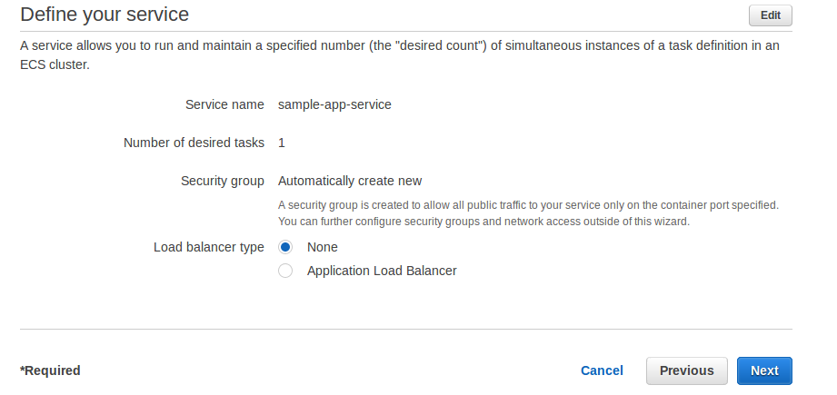

# AWS Elastic Container Service

\\DONE{No images provided so it is difficult to follow - added screenshots}

Amazon Elastic Container Service (Amazon ECS) is used to deploy Docker containers. Following steps are to run docker container on the ECS through AWS management console. These steps are referenced and modified as required from getting started guide \cite{hid-sp18-402-ecst}.

### Prerequisite

AWS account and access to AWS Management console.

### Create IAM User

* Log in to the AWs management console
* Select IAM
* Click Users > Add User
* Enetr User Name as Administrator, select access type as AWS Management Console access, select console password
as custom password and enter password in the box. You can also force password rest by checking Require password reset checkbox, in this 
case we are not forcing password change.
* Click Next Permissions button
* Select "Add user to group" on the next screen and click Create Group
* Enter group name as Administrators. Select Job function as filter or enetr AdministratorAccess in search box in front of the filter.
Select AdministratorAccess from the policy names listed.
* Click Create Group button
* Newly created group will be shown selected. Select the newly created group if it is not selected and click on Review button.
* Click Create User on the next screen
* System will provide confirmation of new user creation

### Create Container and Task

A task is the blueprint of the application. This tutorial will deploy the default sample web app in the docker container using ECS.
* Login to the AWs management console
* Navigate to ECS and Click on Get started link
* This wizard will gudie to deploy application as a container
* First we will select image for the container. Here we are selecting Sample-app image which hosts static website.

 

* Edit task definition as needed using edit button. We are keeping default values.

* Click Next button

### Configure Service

* A service allows to run and maintain a specified number of simultaneous instances of a task definition in an ECS cluster
* ECS will maintain the number of copies provided in the desired number of tasks. We are keeping the default information.
* Select load balancer as None. Application load balancer can be selected if load balancing is required.

* Click Next button

## Configure Cluster

This step will configure Fargate cluster which is fully managed by AWS.
* Enter cluster name

* Click on Next

### Review and Create Resource

* Review information entered till now
* Edit information as needed using edit button
* Click Create
* Next screen shows launch progress. Wait till service is launched. View Service button will be enabled once service is launched.
* Click on View Service once enabled

### Access Deployed Application

Access this deployed sample web application using a web browser by following below steps
* On the Service: service-name page, click the Tasks tab.
* Click on the task deployed in previous steps
* In the Network section, click the ENI Id for your task. This will take you to the EC2 console where you can view the details of the network interface associated with your task, including it's IPv4 Public IP address.
* Enter the IPv4 Public IP address in your web browser and you should see a web page that displays the Amazon ECS sample application. 

### Clean Up

Release the resource created till now ECS Cluster, service etc
* ECS service can be released by updating task to 0 and then deleting the service
* In ECS Console, Click on Clusters
* Click Default
* Select service name checkbox and click update
* Change number of tasks to 0
* Click Next on subsequent screens and Update service on the last screen
* Go back to service listing again and select Delete
* Alternatively service can be deleted without updating number of task to 0. In this case delete will change number of task to 0 and then delete the service.
* Follow the on-screen instructions to delete the service. This will release ECS service.
* Click on Clusters link in ESC console
* Click on default cluster which we created in previous steps
* Clcik Delete Cluster button. Click Delete button in the confirmation box provided.
* This will delete all associated resources.

